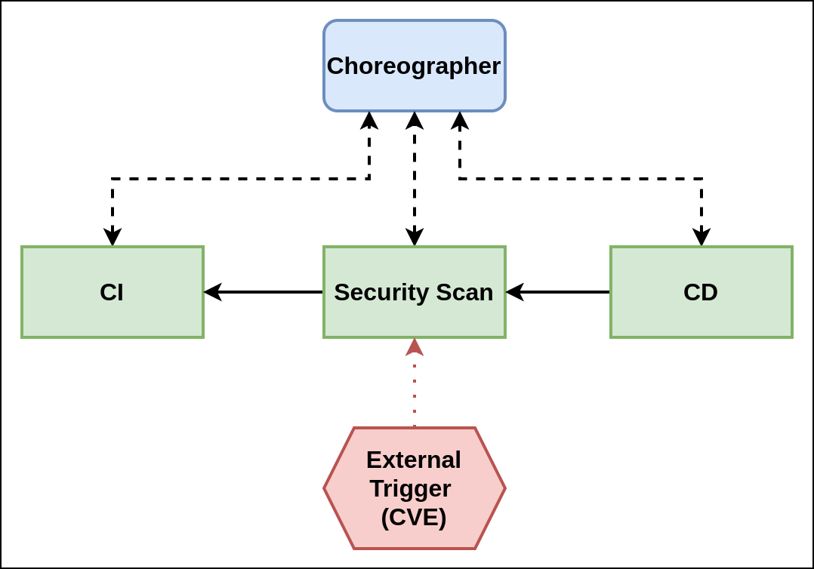

**Supply Chain Choreographer** is based on open source **Cartographer** and allows App Operators to create pre-approved paths to production by integrating Kubernetes resources with the elements of their existing toolchains, for example, Jenkins.

```dashboard:open-url
url: https://cartographer.sh
```

Each pre-approved supply chain creates a paved road to production. Orchestrating supply chain resources - test, build, scan, and deploy - allows developers to focus on delivering value to their users and provides App Operators the assurance that all code in production has passed through all the steps of an approved workflow.

##### Design and Philosophy

Cartographer allows users to define all of the steps that an application must go through to create an image and Kubernetes configuration. Users achieve this with the **Supply Chain** abstraction.

The supply chain consists of resources that are specified via **Templates**. Each template acts as a wrapper for existing Kubernetes resources and allows them to be used with Cartographer. 
There are currently four different types of templates that can be use in a Cartographer supply chain: Source Template, Image Template, Config Template, Deployment Template, and Generic Template.

**Contrary to many other Kubernetes native workflow tools** that already exist in the market, **Cartographer does not “run” any of the objects themselves**. Instead, it monitors the execution of each resource and templates the following resource in the supply chain after a given resource has completed execution and updated its status.

In the **orchestration** model, which is used by most of the current CI/CD tools like Jenkins or Tekton, an **orchestrator** executes, monitor, and manage each of the steps of the path to production. The CI stage, or any others, could not function independently from the orchestrator. In the case of a path to production with a vulnerability scanning step, if a new CVE should arise, the only way to scan the code for it would be to trigger the orchestrator to initiate the scanning step or a new run through the supply chain.


In the **choreography** model, each step of the path to production and the tool required for that step knows nothing about the next step. It is responsible for receiving a signal that it must perform some work, completing it, and signaling that it has finished. In the same case as above, with a pipeline that has a vulnerability scanner, if there was a new CVE, the vulnerability scanner would know about it and trigger a new scan. When the scan is complete, the vulnerability scanner would send a message indicating that scanning is complete.

Because steps of the path to production are rarely synchronous, for example, if a new CVE comes up, someone clicks the button on a build, and so on, choreography is a natural choice as a workflow engine. Flexibility and the ability to swap steps of the path to production is also of extreme importance.

The supply chain may also be **extended to include integrations to existing CI/CD pipelines** like Tekton by using the **Runnable CRD**.

While the supply chain is operator facing, Cartographer also provides an abstraction for developers called **Workloads**. Workloads allow developers to create application specifications such as the location of their repository, environment variables and service claims.

By design, **supply chains can be reused by many workloads**. This allows an operator to specify the steps in the path to production a single time, and for developers to specify their applications independently but for each to use the same path to production. The intent is that developers are able to focus on providing value for their users and can reach production quickly and easily, while providing peace of mind for app operators, who are ensured that each application has passed through the steps of the path to production that they’ve defined.


A **Deliverable** allows the operator to pass information about the configuration to be applied to the environment to the **Delivery**, which continuously deploys and validates Kubernetes configuration to a cluster.

##### Out of the Box Supply Chains
The following three out of the box supply chains are provided with Tanzu Application Platform:

- Out of the Box Supply Chain Basic
- Out of the Box Supply Chain with Testing
- Out of the Box Supply Chain with Testing and Scanning

As auxiliary components, Tanzu Application Platform also includes:
- Out of the Box Templates, for providing templates used by the supply chains to perform common tasks like fetching source code, running tests, and building container images.
- Out of the Box Delivery Basic, for delivering to a Kubernetes cluster the configuration built throughout a supply chain
Both Templates and Delivery Basic are requirements for the Supply Chains.

Let's now have a closer look at Supply Chain Choreographer and the first out of the box Supply Chain (Basic).