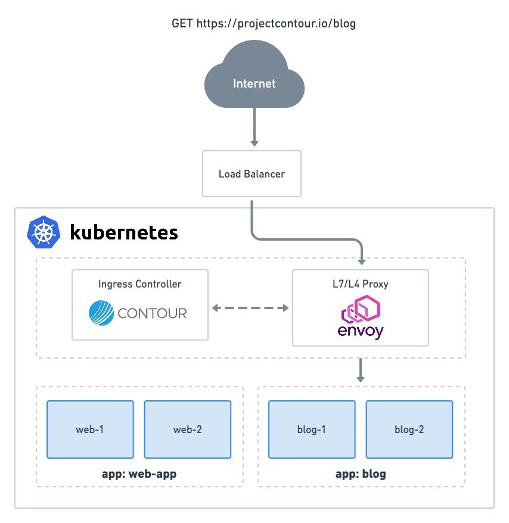

##### cert-manager

cert-manager adds **certificates** and **certificate issuers** as resource types in Kubernetes clusters. It also helps you to **obtain, renew, and use those certificates**. 
It's a prerequisite for several of other TAP components and can also be used to configure HTTPS in TAP e.g. in combination with Contour.

For more information about cert-manager, see the cert-manager documentation.
```dashboard:open-url
url: https://cert-manager.io/next-docs/
```

##### Contour

One of the most critical needs when running workloads at scale on Kubernetes is **efficient and smooth traffic Ingress management at the application layer**. Getting an application up and running is not the entire story; the app still needs a way for users to access it. The ingress controller Contour was designed to fill this operational gap.

In Kubernetes, **Ingress is a set of routing rules that define how external traffic is routed to an application** inside a Kubernetes cluster. An **Ingress controller** watches for changes to objects in the cluster and then **wires together a data path for each request to be resolved**. An Ingress controller processes the requests for resources, provides transport layer security (TLS) termination, and performs other functions.

Contour acts as a control plane for the Envoy edge and service proxy.
**Envoy** is a Layer 7 (application layer) bus for proxy and communication in modern service-oriented architectures, such as Kubernetes clusters. Envoy strives to make the network transparent to applications while maximizing observability to ease troubleshooting.



In the workshop environment, Envoy is exposed over a service of type LoadBalancer and we've added a CNAME record to our DNS registry that maps "&ast;.{{ ENV_TAP_INGRESS }}"to the DNS name of Envoy's LoadBalancer service.
```terminal:execute
command: kubectl get services -n tanzu-system-ingress
clear: true
```

Let's now validate that Contour is functioning correctly by deploying an application, exposing it as a service, then creating an Ingress resource. 
```execute
kubectl create deployment --image=nginx nginx
kubectl expose deployment nginx --port 80
kubectl create ingress nginx --rule="nginx-{{ session_namespace }}.${TAP_INGRESS_DOMAIN}/*=nginx:80"
```

Validate that your resources are deployed and ready.
```terminal:execute
command: kubectl get all,ingress
clear: true
```

```terminal:execute
command: kubectl ingress nginx -o yaml
clear: true
```
The Ingress spec has all the information needed to configure a load balancer or proxy server. Most importantly, it contains a list of rules matched against all incoming requests. 
Each HTTP rule contains the following information: 
- An optional host
- A list of paths, each of which has an associated backend
- A backend is a combination of Service and port names or a custom resource backend.
HTTP (and HTTPS) requests to the Ingress that matches the host and path of the rule are sent to the listed backend.
A defaultBackend is often configured in an Ingress controller to service any requests that do not match a path in the spec.

You should be able to access the application via
```terminal:execute
command: curl -s nginx-{{ session_namespace }}.$TAP_INGRESS_DOMAIN | grep h1
clear: true
```

You can [secure an Ingress](https://kubernetes.io/docs/concepts/services-networking/ingress/#tls) by specifying a Secret that contains a TLS private key and certificate which can be managed by cert-manager. 
Contour’s TLS certificate delegation allows Ingresses to use a TLS certificate from a different namespace. With Ingress v1 you have to define the namespace that contains the TLS certificate via the `projectcontour.io/tls-cert-namespace` annotation because it doesn't allow the secretName field to contain a string with a full namespace/name identifier.
See the documentation here:
```dashboard:open-url
url: https://projectcontour.io/docs/v1.20.1/config/ingress/#tls
```
Keep in mind that you have to use a PackageInstall overlay to change any configuration not exposed via the tap-values.yaml. Therefore adding an overlay for the `projectcontour.io/tls-cert-namespace` annotation is the only way to enable TLS certificate delegation with the Ingress resource.

As well as the **Ingress**, Contour supports a custom resource type **HTTPProxy** which extends the concept of Ingress to add many features that you would normally have to reach for Istio or a similar service mesh to get. Examples are service weighting and configuring the load balancing strategy for multiple services that are configured for a single route.

In TAP most of the components use HTTPProxy, which e.g. has the benefit of being able to reference a TLS Kubernetes Secret in a different namespace in the secretName field. Only *Learning Center for Tanzu Application Service* still uses Ingress resources.

To create a HTTPProxy resource for our deployment, run the following command.
```execute
cat << EOF | kubectl apply -f -
apiVersion: projectcontour.io/v1
kind: HTTPProxy
metadata:
  name: nginx
spec:
  virtualhost:
    fqdn: nginx-http-proxy-{{ session_namespace }}.$TAP_INGRESS_DOMAIN 
  routes:
    - conditions:
      - prefix: /
      services:
        - name: nginx
          port: 80
EOF
```
As you can see, for this basic configuration HTTPProxy has the same options in different format.

After we have validated that the resource is ready ...
```terminal:execute
command: kubectl get httpproxy nginx
clear: true
```

... we can access the application via:
```terminal:execute
command: curl -s nginx-http-proxy-{{ session_namespace }}.$TAP_INGRESS_DOMAIN  | grep h1
clear: true
```

Examples of more advanced features of HttpProxy are rate limiting, weighted routing, and configration of the load balancing strategy for multiple target services.

To debug Ingress issues you can run the following command to see all Ingress/HTTPProxy objects and whether their configuration is valid.
```
kubectl get httpproxy,ingress -A
```

TAP by default uses a single Contour instance to provide internet-visible services. You can install a second Contour instance with service type ClusterIP if you want to expose some services to only the local cluster.

Let’s clean up our resources before we move on to the next component **VMware Tanzu Build Service**.
```execute
kubectl delete HTTPProxy nginx
kubectl delete Ingress nginx
kubectl delete Deployment nginx
kubectl delete Service nginx
````